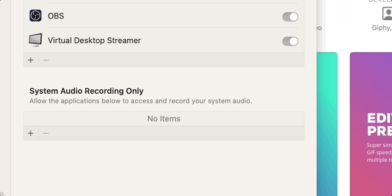

# Creating Quizzes on Canvas with Google Colab and ChatGPT

Welcome to this step-by-step tutorial on how to create quizzes on Canvas using a Google Colab notebook and ChatGPT. This guide will walk you through the entire process, from setting up your environment to uploading your first quiz to Canvas.

## Table of Contents

1. [Prerequisites](#prerequisites)
2. [Setting Up the Google Colab Notebook](#setting-up-the-google-colab-notebook)
3. [Configuring Your Canvas Credentials](#configuring-your-canvas-credentials)
4. [Generating Quiz Questions with ChatGPT](#generating-quiz-questions-with-chatgpt)
5. [Uploading Your Quiz using Google Colab](#uploading-your-quiz-using-google-colab)
6. [Conclusion](#conclusion)

---

## Prerequisites

Before we begin, ensure you have the following:

- A [Google](https://www.google.com/) account to access [Google Colab](https://colab.research.google.com/).
- A [Canvas](https://www.instructure.com/canvas/) account with API access.
- A Canvas API key and Course ID.
- Access to [ChatGPT](https://chat.openai.com/) for generating quiz questions.
- Basic knowledge of Python (optional but helpful).

---

## Setting Up the Google Colab Notebook

1. **Access the Google Colab Notebook:**

   Open your web browser and navigate to the Google Colab notebook template provided [here](https://colab.research.google.com/drive/19esEHrqmQWgpICTG4ICwVVszmTXDx76S?usp=sharing). Alternatively, you can use your own Colab notebook.

2. **Copy the Notebook (If Using a Template):**

   If you’re using a shared template, make a copy to your Google Drive by clicking on `File` > `Save a copy in Drive`.

3. **Familiarize Yourself with the Notebook:**

   Review the cells in the notebook to understand where you'll be inputting your Canvas credentials and quiz questions.

---

## Configuring Your Canvas Credentials

To interact with Canvas’s API, you need to provide your Canvas API key and Course ID in the Colab notebook.

1. **Locate Your Canvas API Key and Course ID:**

   - **Canvas API Key:** 
     - Log in to your Canvas account.
     - Navigate to `Account` > `Settings`.
     - Scroll down to `Approved Integrations` and click on `+ New Access Token`.
     - Generate a new API key and copy it.
   
   - **Course ID:** 
     - Navigate to the specific course on Canvas.
     - Look at the URL in your browser. It will look something like `https://yourinstitution.instructure.com/courses/12345`.
     - The number at the end (`12345` in this example) is your Course ID.

2. **Amend the Colab Notebook with Your Credentials:**

   In the Colab notebook, locate the section where you need to input your Canvas API key and Course ID. Replace the placeholder text with your actual credentials.

   ```python
   #@title # Define Key Values (User Input Required)
   CANVAS_API_KEY = "YOUR_CANVAS_API_KEY" 
   COURSE_ID = "YOUR_COURSE_ID"
   ```

## Generating Quiz Questions with ChatGPT

To create a `quiz_questions` object, you'll interact with ChatGPT using a specific prompt. Follow these steps:

1. **Open ChatGPT:**

   Navigate to <a href="https://www.chatgpt.com" target="_blank">ChatGPT</a> and ensure you're logged in.

2. **Copy and Paste the Following Prompt Template into ChatGPT:**

   ```markdown
   I am creating a multiple-choice quiz for my Canvas course. Please generate a `quiz_questions` Python object based on the following parameters:

   Parameters
   - Topic: [Insert Topic Here or Insert 'Refer to Uploaded File']
   - Levels of Difficulty: [Insert Difficulty Levels Here, e.g., "Easy", "Medium", "Hard"]
   - Number of Questions: [Insert Number of Questions Here]

   Each question should have the following structure:

   quiz_questions = [
    {
        'question_name': 'Sample Multiple Choice Question',
        'question_type': 'multiple_choice_question',
        'question_text': '''[Insert Question Text Here]''',
        'points_possible': 1,
        'answers': [
            {'text': 'Option A', 'weight': 0},
            {'text': 'Option B', 'weight': 0},
            {'text': 'Option C', 'weight': 100},  # Correct answer
            {'text': 'Option D', 'weight': 0}
        ]
    },
    # Repeat for the specified number of questions
   ]
   ```
   <!-- Centered and resized image using HTML tags -->
   <p align="center">
     
   </p>

3. **Edit Prompt Parameters:**

   Before sending your prompt to ChatGPT, you can customize your parameters to tailor the generated quiz questions to better fit your course material and desired difficulty level. Here’s how to effectively edit and optimize your prompt:

4. **Generate `quiz_questions` Object:**

   Enter your prompt into ChatGPT and watch the magic happen!

5. **Copy and Paste the Generated `quiz_questions` Object into Colab Template**

   Copy over your newly generated quiz_questions object back into your Google Colab template.

## Uploading Your Quiz using Google Colab

1. **Double-Check User Inputs**

   Make sure all user inputs are present and correct.

2. **Run Application**

   Run the application by clicking on `Runtime` > `Run all`.

3. **Find Your Quiz in Canvas**

   - Log in to your Canvas account.
   - Navigate to `Courses` > `'YOUR_COURSE'` > `Quizzes`.
   
   You should now see your newly generated quiz.